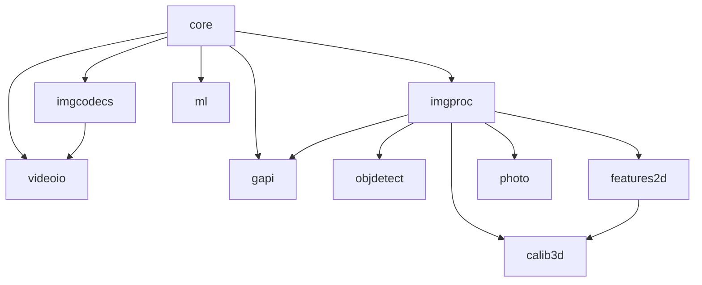

# Agent 任务分配表

**重要说明：本项目所有 Agent 协作相关文档和代码注释必须使用中文。**

## 当前状态

| Agent | 模块 | 状态 | 优先级 | 预计完成时间 | 负责人 |
|-------|------|------|--------|-------------|--------|
| Agent A | core | ✅ 已完成 | 1 | - | - |
| Agent B | imgproc | 🔄 进行中 | 2 | 2024-09-20 | - |
| Agent C | imgcodecs | ⏳ 待开始 | 2 | 2024-09-22 | - |
| Agent D | objdetect | ⏳ 待开始 | 3 | 2024-09-25 | - |
| Agent E | features2d | ⏳ 待开始 | 3 | 2024-09-25 | - |
| Agent F | photo | ⏳ 待开始 | 4 | 2024-09-28 | - |
| Agent G | calib3d | ⏳ 待开始 | 4 | 2024-09-30 | - |
| Agent H | videoio | ⏳ 待开始 | 3 | 2024-09-27 | - |
| Agent I | ml | ⏳ 待开始 | 5 | 2024-10-02 | - |
| Agent J | gapi | ⏳ 待开始 | 6 | 2024-10-05 | - |

## 详细任务分解

### Agent A: Core 模块 (已完成)
- [x] 创建模块接口
- [x] 实现 Mat 基础操作
- [x] 实现数学运算函数
- [x] 实现数组操作函数
- [x] 添加单元测试
- [x] 编写文档

### Agent B: ImgProc 模块 (进行中)
- [ ] 创建模块骨架
- [ ] 实现图像滤波函数
  - [ ] GaussianBlur
  - [ ] MedianBlur
  - [ ] BilateralFilter
  - [ ] BoxFilter
- [ ] 实现几何变换
  - [ ] resize
  - [ ] warpAffine
  - [ ] warpPerspective
  - [ ] getRotationMatrix2D
- [ ] 实现形态学操作
  - [ ] erode
  - [ ] dilate
  - [ ] morphologyEx
  - [ ] getStructuringElement
- [ ] 实现颜色空间转换
  - [ ] cvtColor
  - [ ] COLOR_BGR2GRAY
  - [ ] COLOR_GRAY2BGR
- [ ] 添加测试和文档

### Agent C: ImgCodecs 模块 (待开始)
- [ ] 创建模块骨架
- [ ] 实现图像读取
  - [ ] imread
  - [ ] imreadmulti
  - [ ] imdecode
- [ ] 实现图像保存
  - [ ] imwrite
  - [ ] imwritemulti
  - [ ] imencode
- [ ] 实现格式支持
  - [ ] JPEG
  - [ ] PNG
  - [ ] TIFF
  - [ ] WebP
- [ ] 添加测试和文档

### Agent D: ObjDetect 模块 (待开始)
- [ ] 创建模块骨架
- [ ] 实现级联分类器
  - [ ] CascadeClassifier
  - [ ] detectMultiScale
- [ ] 实现 HOG 检测器
  - [ ] HOGDescriptor
  - [ ] detect
- [ ] 实现 QR 码检测
  - [ ] QRCodeDetector
  - [ ] detectAndDecode
- [ ] 添加测试和文档

### Agent E: Features2D 模块 (待开始)
- [ ] 创建模块骨架
- [ ] 实现特征检测器
  - [ ] SIFT
  - [ ] SURF
  - [ ] ORB
  - [ ] FAST
- [ ] 实现描述符匹配
  - [ ] BFMatcher
  - [ ] FlannBasedMatcher
  - [ ] match
  - [ ] knnMatch
- [ ] 实现关键点操作
  - [ ] KeyPoint
  - [ ] drawKeypoints
- [ ] 添加测试和文档

### Agent F: Photo 模块 (待开始)
- [ ] 创建模块骨架
- [ ] 实现图像修复
  - [ ] inpaint
  - [ ] fastNlMeansDenoising
- [ ] 实现 HDR 处理
  - [ ] createMergeMertens
  - [ ] createTonemap
- [ ] 实现图像增强
  - [ ] enhanceDetail
  - [ ] colorChange
- [ ] 添加测试和文档

### Agent G: Calib3D 模块 (待开始)
- [ ] 创建模块骨架
- [ ] 实现相机标定
  - [ ] calibrateCamera
  - [ ] calibrateCameraRO
  - [ ] stereoCalibrate
- [ ] 实现立体视觉
  - [ ] stereoRectify
  - [ ] stereoRectifyUncalibrated
  - [ ] computeCorrespondEpilines
- [ ] 实现 PnP 算法
  - [ ] solvePnP
  - [ ] solvePnPRansac
- [ ] 添加测试和文档

### Agent H: VideoIO 模块 (待开始)
- [ ] 创建模块骨架
- [ ] 实现视频读取
  - [ ] VideoCapture
  - [ ] read
  - [ ] grab
  - [ ] retrieve
- [ ] 实现视频保存
  - [ ] VideoWriter
  - [ ] write
- [ ] 实现摄像头操作
  - [ ] open
  - [ ] isOpened
  - [ ] set
  - [ ] get
- [ ] 添加测试和文档

### Agent I: ML 模块 (待开始)
- [ ] 创建模块骨架
- [ ] 实现分类器
  - [ ] SVM
  - [ ] KNearest
  - [ ] DecisionTree
- [ ] 实现回归器
  - [ ] LinearRegression
  - [ ] LogisticRegression
- [ ] 实现聚类
  - [ ] KMeans
  - [ ] DBSCAN
- [ ] 添加测试和文档

### Agent J: G-API 模块 (待开始)
- [ ] 创建模块骨架
- [ ] 实现计算图
  - [ ] GComputation
  - [ ] GMat
  - [ ] GInfer
- [ ] 实现后端
  - [ ] CPU
  - [ ] OpenCL
  - [ ] Inference Engine
- [ ] 实现流水线
  - [ ] GStreamingCompile
  - [ ] GStreamingApply
- [ ] 添加测试和文档

## 依赖关系图

## 里程碑

### 里程碑 1: 基础模块完成 (2024-09-20)
- [x] Core 模块
- [ ] ImgProc 模块
- [ ] ImgCodecs 模块

### 里程碑 2: 检测模块完成 (2024-09-25)
- [ ] ObjDetect 模块
- [ ] Features2D 模块
- [ ] VideoIO 模块

### 里程碑 3: 高级模块完成 (2024-09-30)
- [ ] Photo 模块
- [ ] Calib3D 模块

### 里程碑 4: 完整功能 (2024-10-05)
- [ ] ML 模块
- [ ] G-API 模块
- [ ] 集成测试
- [ ] 性能优化

## 注意事项

1. **依赖管理**: 每个 Agent 需要确保其模块的依赖已实现
2. **接口一致性**: 所有模块必须遵循统一的接口规范
3. **测试覆盖**: 每个模块都需要完整的单元测试和集成测试
4. **文档同步**: 代码和文档需要同步更新
5. **性能要求**: 所有函数都需要满足性能基准

## 联系方式

- 项目仓库: https://github.com/your-org/opencvspeed
- 问题跟踪: https://github.com/your-org/opencvspeed/issues
- 文档站点: https://your-org.github.io/opencvspeed
